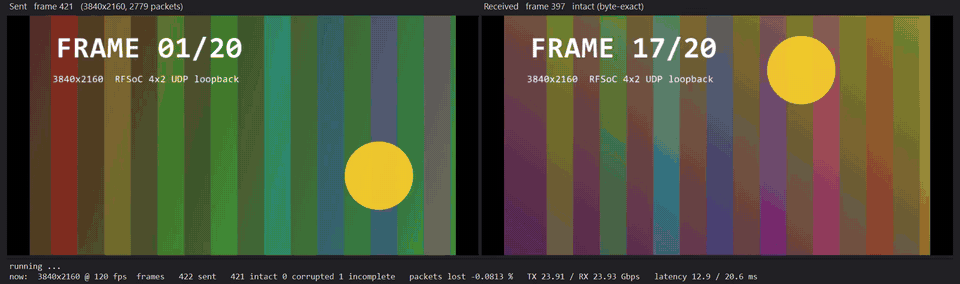
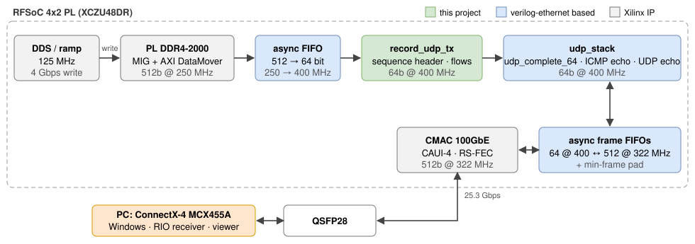

-9A90FD.svg)   

[English](#en) | [中文](#cn)

　

<span id="en">RFSoC 4x2 25G UDP over QSFP28</span>
===========================

Hardware UDP/IP on the RFSoC 4x2 (XCZU48DR-FFVG1517-2-E) with the 100GbE CMAC on QSFP28: ARP, ICMP echo, UDP echo, and a UDP stream of PL DDR4-2400 data at **25.3 Gbps, received on Windows with zero loss**. **4K video (3840x2160 RGB24) loops through the FPGA at up to 120 fps (23.9 Gbps each way)**, every frame compared byte by byte. The 100G version is [rfsoc4x2_100g_udp](https://github.com/uceeyuf/rfsoc4x2_100g_udp): on Windows the receive path could not keep up with 100G (not solved yet), so it moved to a Linux host with DPDK. RDMA (RoCE v2) on the same board, with the AMD ERNIC IP, is [rfsoc4x2_ernic](https://github.com/uceeyuf/rfsoc4x2_ernic): RDMA WRITE / READ into PL DDR4 at 98 Gbit/s.

Built on Alex Forencich's [verilog-ethernet](https://github.com/alexforencich/verilog-ethernet) (MIT), included as a submodule pinned at `274831c`.

　

|  |
| :----------------------------------: |
| **Figure1** : 4K120 through the FPGA echo on the board: sent frames (left) and the echoed frames (right), every frame compared byte by byte, 23.9 Gbps each way |

　

|  |
| :------------------------------: |
| **Figure2** : 25G data path      |

　

## Technical Features

* **64-bit stack at 400 MHz** (25.6 Gbps) on the CMAC 100GbE link (CAUI-4, RS-FEC), 64 ↔ 512-bit async frame FIFOs; 256 KB receive FIFO, 128 KB echo FIFO and 32 KB checksum buffer absorb line-rate bursts from the 100G link.
* **ARP, ICMP echo, UDP echo**. The echo receive side never waits for the transmit side: no deadlock while the peer MAC is being resolved, and on overload whole packets are dropped, never corrupted.
* **Alias addresses**: besides its own address the FPGA answers ARP and UDP echo on a block of 32 addresses and replies from the address a packet was sent to. 16 flows to 16 addresses spread over the PC's receive queues (Windows RSS hashes UDP on IP addresses only), with no firewall rule needed.
* **DDR4 record stream**: 125 MSps DDS samples written to PL DDR4-2400 (MIG, 512 bit @ 300 MHz) and read back as UDP packets with a sequence header; up to 31 flows (source IP rotated inside the alias block), 8 KB jumbo frames, runtime packet gap.
* **Upstream fixes**: `rtl/udp_checksum_gen_64.v` (a header was dropped when its FIFO filled up); `rtl/arp.v` adds the alias addresses.
* **Host tools**: video loopback viewer (C# UI + C++ Registered I/O packet engine: 16 paced flows, send-rate shaping, byte-exact frame check, frame-rate sweep), C++ RIO stream receiver.

　

## Performance Test Results

Setup: Mellanox ConnectX-4 MCX455A, Windows 11, Intel Core Ultra 7 265K. FPGA `192.168.100.1` (aliases `.128`–`.159`), PC `192.168.100.2/24` (the same plan as [rfsoc4x2_corundum](https://github.com/uceeyuf/rfsoc4x2_corundum)). Details: [test report](./docs/TEST_REPORT.md).

| Test | Result |
| :--- | :----- |
| ping / ARP | 4/4 replies |
| UDP echo 1234 / 1235, 18–1472 B | 2000/2000 per port, byte-exact |
| PL DDR4-2400 calibration | all stages pass, tCK 833 ps ([log](./docs/results/ddr4_2400_calibration.txt)) |
| 4K video loopback, 16 flows, 10 s per rate | **4K120: 1200/1200 frames, 23.9 Gbps each way**, 3 of 3 runs, 0 packets lost ([log](./docs/results/video_4k_2400.txt)) |
| DDR4 stream, 8 flows, jumbo, 60 s | **25.28 Gbps payload, 23,122,319 packets, zero loss** ([log](./docs/results/ddr4_2400_stream_60s.txt)) |
| Stream stop / start (`tests/restart_check.tcl`), 5 × 3000 packets | every sample matches its packet header |
| Timing | WNS +0.050 ns, WHS +0.010 ns |

At 4K120 the echo runs at 95 % of the 25.6 Gbps datapath, so the host shapes its sending to 25 Gbps (`--max-gbps 25`). Without shaping, a send thread that Windows did not run for a moment sends its backlog at the 100G line rate, more than the design can buffer, and 1–2 frames per run were lost. 4K125 and above exceed the shaped rate.

| Flows | FPGA TX    | PC RX      | Loss |
| :---: | :--------: | :--------: | :--: |
| 1     | 25.25 Gbps | 19.65 Gbps | 22 % |
| 2     | 25.29 Gbps | 25.29 Gbps | 0    |
| 8     | 25.31 Gbps | 25.31 Gbps | 0    |
| 16    | 25.33 Gbps | 25.33 Gbps | 0    |

DDR4 stream: a single flow is limited by one RSS queue on the PC, hence the source-IP rotation.

|  |
| :-------------------------------------------: |
| **Figure3** : frame-rate sweep in `host/UdpLoopbackViewer` (green = all frames intact): every frame intact up to 4K120; above that the rate exceeds the 25 Gbps the host is shaped to |

　

## Build and Run

Vivado 2023.2:

```
git clone --recursive https://github.com/uceeyuf/rfsoc4x2_25g_udp.git
vivado -mode batch -source scripts/build.tcl -tclargs 16
vivado -mode batch -source scripts/program.tcl
```

Writes `build/fpga.bit` and `build/fpga.ltx`. PC NIC: `192.168.100.2/24`, jumbo frames (9014), 16 RSS queues. Host tools build with the in-box MSVC / .NET Framework 4.8: `host\UdpLoopbackViewer\build.bat`, `tests\rio_rx\build.bat`.

```
host\UdpLoopbackViewer\UdpLoopbackViewer.exe --max-gbps 25 --sweep 60,80,100,110,120,125,130   # 4K frame-rate sweep
host\UdpLoopbackViewer\UdpLoopbackViewer.exe --res 1920x1080 --fps 60            # one run
tests\rio_rx\rio_udp_rx.exe 60 8 4                                                # receive the stream ...
vivado -mode batch -source scripts/vio_speed.tcl -tclargs 1 0 2088                # ... start: 8 flows + IP rotation + jumbo
```

The viewer sends flow i to `192.168.100.128 + i`, port 1234 (defaults: 16 flows, 8956 frame bytes per packet, 20 pre-rendered frames sent in turn). Simulation: `sim/tb_udp_stack.v` (Icarus Verilog: ARP incl. alias addresses, ICMP, echo bursts, back-pressure).

　

## Layout

```
rtl/          design sources
ip/           Vivado IP (.xci, and .tcl for IP created by script)
constraints/  pins, DDR4, CDC
scripts/      create_project / build / program / vio_speed
sim/          Icarus Verilog testbenches
host/         UdpLoopbackViewer (C# UI + C++ RIO engine)
tests/        loopback test, sweeps, RIO receiver, disk benchmark
pc/           Python capture scripts for the stream
docs/         test report, figures, raw results
third_party/  verilog-ethernet (submodule)
```

　

## Citation

If this work helps your research, please cite it:

```bibtex
@misc{yu2026rfsoc4x2_25g,
    author = {Yijie Yu},
    title = {{RFSoC 4x2 25G UDP over QSFP28}},
    year = {2026},
    howpublished = {\url{https://github.com/uceeyuf/rfsoc4x2_25g_udp}},
    note = {GitHub repository},
}
```

GitHub also offers the citation under **Cite this repository** (from [CITATION.cff](CITATION.cff)).

　

## License

BSD 3-Clause (Copyright (c) 2026, Yijie Yu). verilog-ethernet and files derived from it remain under the MIT license.

　

　

<span id="cn">RFSoC 4x2 25G UDP（QSFP28）</span>
===========================

在 RFSoC 4x2（XCZU48DR-FFVG1517-2-E）上利用 QSFP28 口的 100GbE CMAC 实现的纯硬件 UDP/IP：ARP、ICMP 回显（ping）、UDP 回环，以及把 PL DDR4-2400 数据以 **25.3 Gbps 发往 Windows 且零丢包** 的 UDP 数据流。**4K 视频（3840x2160 RGB24）经 FPGA 回环最高 120 fps（每方向 23.9 Gbps）**，每一帧逐字节比对。100G 版本见 [rfsoc4x2_100g_udp](https://github.com/uceeyuf/rfsoc4x2_100g_udp)：Windows 下接收路径跟不上 100G 的问题暂未解决，因此换到了 Linux 主机（DPDK）。同一块板上用 AMD ERNIC IP 做的 RDMA（RoCE v2）见 [rfsoc4x2_ernic](https://github.com/uceeyuf/rfsoc4x2_ernic)：RDMA WRITE / READ 读写 PL DDR4，98 Gbit/s。

基于 Alex Forencich 的 [verilog-ethernet](https://github.com/alexforencich/verilog-ethernet)（MIT），以子模块形式引入（`274831c`）。

　

|  |
| :----------------------------------: |
| **图1** : 上板 4K120 经 FPGA 回环：左边是发出的帧，右边是回环回来的帧，每帧逐字节比对，每方向 23.9 Gbps |

　

|  |
| :------------------------------: |
| **图2** : 25G 数据通路            |

　

## 技术特点

* **64 位协议栈 @ 400 MHz**（25.6 Gbps），跑在 CMAC 100GbE 链路上（CAUI-4，RS-FEC），64 ↔ 512 位异步帧 FIFO 跨时钟域；256 KB 接收 FIFO、128 KB 回环 FIFO 和 32 KB 校验和缓冲吸收 100G 链路的线速突发。
* **ARP、ICMP 回显、UDP 回环**。回环的接收侧从不等待发送侧：对端 MAC 尚未解析时不会死锁；过载时整包丢弃，绝不产生错包。
* **别名地址**：除本机地址外，FPGA 还在一段 32 个地址上应答 ARP 和 UDP 回环，并从包的目的地址回复。16 条 flow 发往 16 个地址，就能分散到 PC 的多个接收队列（Windows RSS 对 UDP 只按 IP 哈希），而且不需要防火墙规则。
* **DDR4 记录数据流**：125 MSps 的 DDS 样本写入 PL DDR4-2400（MIG，512 bit @ 300 MHz），再读出并加上序号头以 UDP 发出；最多 31 条 flow（源 IP 在别名段内轮换），支持 8 KB 巨帧，包间隔可在线调整。
* **上游修改**：`rtl/udp_checksum_gen_64.v`（头 FIFO 满时会丢包头）；`rtl/arp.v` 增加别名地址。
* **上位机工具**：视频回环查看器（C# 界面 + C++ Registered I/O 收发引擎：16 条定速 flow、发送整形、逐字节比对、帧率扫描），C++ RIO 数据流接收程序。

　

## 性能测试结果

测试环境：Mellanox ConnectX-4 MCX455A，Windows 11，Intel Core Ultra 7 265K。FPGA `192.168.100.1`（别名 `.128`–`.159`），PC `192.168.100.2/24`（与 [rfsoc4x2_corundum](https://github.com/uceeyuf/rfsoc4x2_corundum) 相同的地址规划）。详见[测试报告](./docs/TEST_REPORT.md#cn)。

| 测试 | 结果 |
| :--- | :--- |
| ping / ARP | 4/4 回复 |
| UDP 回环 1234 / 1235，18–1472 字节 | 每端口 2000/2000，逐字节一致 |
| PL DDR4-2400 校准 | 各阶段全部通过，tCK 833 ps（[日志](./docs/results/ddr4_2400_calibration.txt)） |
| 4K 视频回环，16 flow，每档 10 秒 | **4K120：1200/1200 帧，每方向 23.9 Gbps**，3 次全部通过，0 丢包（[日志](./docs/results/video_4k_2400.txt)） |
| DDR4 数据流，8 flow，巨帧，60 秒 | **有效载荷 25.28 Gbps，23,122,319 个包，零丢包**（[日志](./docs/results/ddr4_2400_stream_60s.txt)） |
| 数据流停止 / 重启（`tests/restart_check.tcl`），5 次 × 3000 包 | 所有样本与包头序号一致 |
| 时序 | WNS +0.050 ns，WHS +0.010 ns |

4K120 时回环已用到 25.6 Gbps 数据通路的 95%，所以主机把发送整形到 25 Gbps（`--max-gbps 25`）。不整形时，Windows 偶尔没有及时调度的发送线程会按 100G 线速补发积压的包，超过本设计能缓冲的量，每次会丢 1–2 帧。4K125 及以上超过整形速率。

| flow 数 | FPGA 发送  | PC 接收    | 丢包 |
| :-----: | :--------: | :--------: | :--: |
| 1       | 25.25 Gbps | 19.65 Gbps | 22 % |
| 2       | 25.29 Gbps | 25.29 Gbps | 0    |
| 8       | 25.31 Gbps | 25.31 Gbps | 0    |
| 16      | 25.33 Gbps | 25.33 Gbps | 0    |

DDR4 数据流：单条 flow 受限于 PC 上的单个 RSS 队列，所以需要轮换源 IP。

|  |
| :-------------------------------------------: |
| **图3** : 上位机 `host/UdpLoopbackViewer` 帧率扫描（绿色 = 全部帧完好）：4K120 以内全部帧完好；再往上超过主机整形的 25 Gbps |

　

## 编译与运行

Vivado 2023.2：

```
git clone --recursive https://github.com/uceeyuf/rfsoc4x2_25g_udp.git
vivado -mode batch -source scripts/build.tcl -tclargs 16
vivado -mode batch -source scripts/program.tcl
```

生成 `build/fpga.bit` 与 `build/fpga.ltx`。PC 网卡：`192.168.100.2/24`，开巨帧（9014）和 16 个 RSS 队列。上位机工具用系统自带的 MSVC / .NET Framework 4.8 编译：`host\UdpLoopbackViewer\build.bat`、`tests\rio_rx\build.bat`。

```
host\UdpLoopbackViewer\UdpLoopbackViewer.exe --max-gbps 25 --sweep 60,80,100,110,120,125,130   # 4K 帧率扫描
host\UdpLoopbackViewer\UdpLoopbackViewer.exe --res 1920x1080 --fps 60            # 单次运行
tests\rio_rx\rio_udp_rx.exe 60 8 4                                                # 接收数据流 ……
vivado -mode batch -source scripts/vio_speed.tcl -tclargs 1 0 2088                # …… 启动：8 flow + 源 IP 轮换 + 巨帧
```

查看器把第 i 条 flow 发往 `192.168.100.128 + i` 的 1234 端口（默认 16 条 flow，每包 8956 字节帧数据，20 帧预渲染轮流发送）。仿真：`sim/tb_udp_stack.v`（Icarus Verilog：ARP（含别名地址）、ICMP、回环突发、反压）。

　

## 目录结构

```
rtl/          设计源码
ip/           Vivado IP（.xci，以及用脚本创建的 IP 的 .tcl）
constraints/  管脚、DDR4、跨时钟域约束
scripts/      create_project / build / program / vio_speed
sim/          Icarus Verilog 仿真
host/         UdpLoopbackViewer（C# 界面 + C++ RIO 引擎）
tests/        回环测试、扫描脚本、RIO 接收程序、磁盘测试
pc/           数据流的 Python 采集脚本
docs/         测试报告、图、原始数据
third_party/  verilog-ethernet（子模块）
```

　

## 引用

如果这个项目对你的研究有帮助，请引用：

```bibtex
@misc{yu2026rfsoc4x2_25g,
    author = {Yijie Yu},
    title = {{RFSoC 4x2 25G UDP over QSFP28}},
    year = {2026},
    howpublished = {\url{https://github.com/uceeyuf/rfsoc4x2_25g_udp}},
    note = {GitHub repository},
}
```

GitHub 仓库页的 **Cite this repository** 也提供同样的引用（来自 [CITATION.cff](CITATION.cff)）。

　

## 许可证

BSD 3-Clause（Copyright (c) 2026, Yijie Yu）。verilog-ethernet 及其派生文件仍遵循 MIT 许可证。
