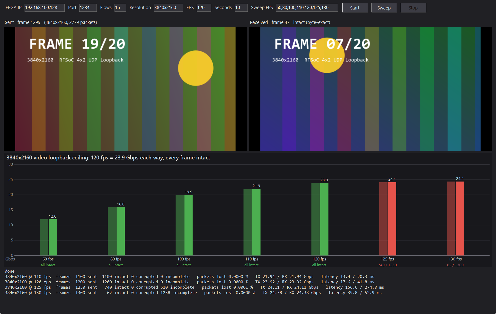
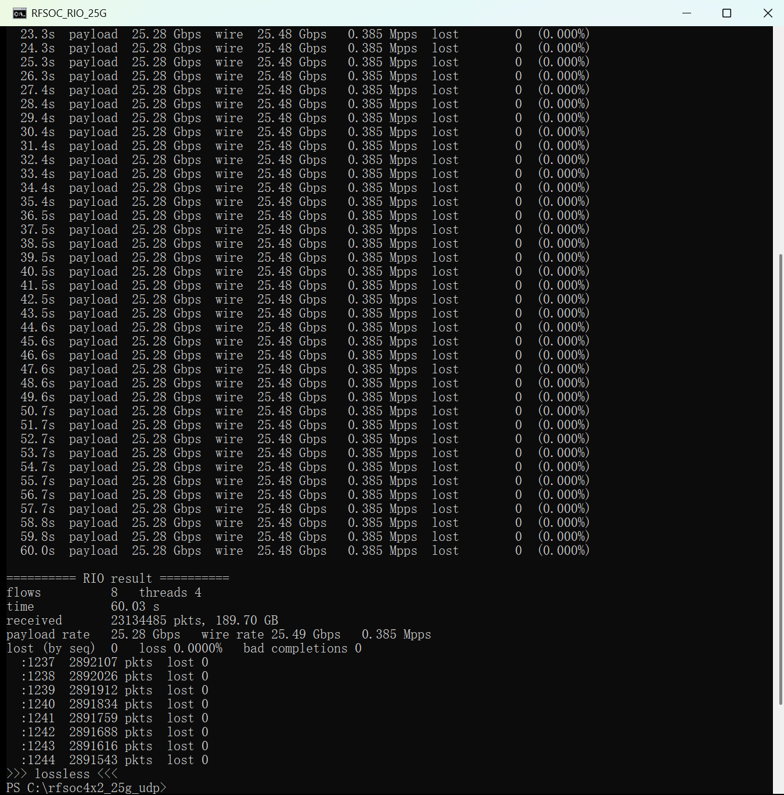

[English](#en) | [中文](#cn)

　

Test Report
===========================

Setup: RFSoC 4x2 QSFP28 (CMAC, 100GbE link) ↔ Mellanox ConnectX-4 MCX455A (PCIe 3.0 x16), Windows 11, Intel Core Ultra 7 265K. FPGA `192.168.100.1` (alias addresses `.128`–`.159`), PC `192.168.100.2/24`. Vivado 2023.2. PC NIC: jumbo 9014, 16 RSS queues / processors, 4096 receive buffers.

　

# 25G

## Functional

| Test | Result |
| :--- | :----- |
| `ping` right after configuration | 4/4 replies |
| UDP echo 1234 / 1235 (`tests/loopback_test.py`, 18–1472 B) | 2000/2000 per port, byte-exact |
| Loopback viewer, 1920x1080 @ 60 fps, 16 flows to the alias addresses, 5 s | 300/300 frames intact, 0 packets lost |

## 4K Video Loopback

`host/UdpLoopbackViewer`: 3840x2160 RGB24 frames (20 pre-rendered, sent in turn), 2779 packets of 8956 frame bytes per frame, 16 flows to `192.168.100.128`–`.143`, packets of a frame spread evenly over the frame interval, sending shaped to 25 Gbps (`--max-gbps 25`). The FPGA echoes every packet; the host reassembles every frame and compares it byte by byte. A rate passes when every frame is intact and the frames went out at that rate. 10 s per rate.

| Rate  | Each way   | Frames intact   | Packets lost |
| :---: | :--------: | :-------------: | :----------: |
| 4K60  | 11.97 Gbps | 600 / 600       | 0            |
| 4K80  | 15.95 Gbps | 800 / 800       | 0            |
| 4K100 | 19.94 Gbps | 1000 / 1000     | 0            |
| 4K110 | 21.94 Gbps | 1100 / 1100     | 0            |
| 4K120 | 23.92 Gbps | **1200 / 1200** | 0            |
| 4K125 | 24.11 Gbps (target 24.93) | 740 / 1250 | 0.0001 % |

4K120 passed in all four runs (the sweep and three single runs), 0 packets lost, the PC NIC counting every echoed packet. At this rate the echo runs at 95 % of the 25.6 Gbps datapath. Without shaping, a send thread that Windows did not run for a moment sent its backlog at the 100G line rate, more than the design can buffer: 3–51 packets per run were dropped inside the FPGA and 1–2 frames lost. 4K125 and above need more than the shaped 25 Gbps; the frames fall behind and time out.

|  |
| :-----------------------------------: |
| **Figure1** : 4K frame-rate sweep     |

## Stream Throughput

DDR4 data, 8200-byte jumbo UDP payload, `tx_delay = 0`, flows rotate source IP and ports, receiver `tests/rio_rx/rio_udp_rx.exe`.

| Flows | FPGA TX    | PC RX      | Loss |
| :---: | :--------: | :--------: | :--: |
| 1     | 25.25 Gbps | 19.65 Gbps | 22 % |
| 2     | 25.29 Gbps | 25.29 Gbps | 0    |
| 8     | 25.31 Gbps | 25.31 Gbps | 0    |
| 16    | 25.33 Gbps | 25.33 Gbps | 0    |

60 s, 8 flows: 23,134,485 packets / 189.7 GB, **25.28 Gbps payload (25.49 Gbps on the wire), zero loss**.

|        |
| :----------------------------------: |
| **Figure2** : 60 s stream, 8 flows   |

A single flow is limited by one RSS queue (~0.3 Mpps); this NIC hashes UDP by IP only, hence the source-IP rotation.

## Disk, Simulation, Timing

* Disk (C:, Samsung 990 EVO Plus 1 TB), unbuffered sequential write: ~5.3 GB/s for the first ~21 GB (SLC cache), then ~0.3 GB/s.
* `sim/tb_udp_stack.v` (Icarus Verilog): ARP (also for an alias address), ICMP echo, UDP echo while the peer MAC is unresolved, 120-packet echo bursts (1 B to 8 KB) mixed with stream packets, overload with random MAC back-pressure, recovery, echo from 16 alias addresses. All pass; with the unmodified upstream `udp_checksum_gen_64` the burst tests fail.
* Stream stopped and restarted 5 times (`tests/restart_check.tcl`, ramp test data): 3000 packets each, every sample matches the start_index in its header.
* Timing met: WNS +0.045 ns, WHS +0.010 ns (`results/timing_summary.rpt`).

　

　

　

测试报告
===========================

测试环境：RFSoC 4x2 QSFP28（CMAC，100GbE 链路）↔ Mellanox ConnectX-4 MCX455A（PCIe 3.0 x16），Windows 11，Intel Core Ultra 7 265K。FPGA `192.168.100.1`（别名地址 `.128`–`.159`），PC `192.168.100.2/24`。Vivado 2023.2。PC 网卡设置：巨帧 9014，16 个 RSS 队列 / 处理器，接收缓冲 4096。

　

# 25G

## 功能测试

| 测试 | 结果 |
| :--- | :--- |
| 配置后立即 `ping` | 4/4 回复 |
| UDP 回环 1234 / 1235（`tests/loopback_test.py`，18–1472 字节） | 每端口 2000/2000，逐字节一致 |
| 回环查看器，1920x1080 @ 60 fps，16 flow 发往别名地址，5 秒 | 300/300 帧完好，0 丢包 |

## 4K 视频回环

`host/UdpLoopbackViewer`：3840x2160 RGB24 帧（预渲染 20 帧轮流发送），每帧 2779 个包、每包 8956 字节帧数据，16 条 flow 发往 `192.168.100.128`–`.143`，每帧的包均匀分布在帧间隔内，发送整形到 25 Gbps（`--max-gbps 25`）。FPGA 回送每个包，主机重组每一帧并逐字节比对。所有帧完好且按该帧率发出才算通过。每档 10 秒。

| 帧率  | 每方向     | 完好帧          | 丢包率     |
| :---: | :--------: | :-------------: | :--------: |
| 4K60  | 11.97 Gbps | 600 / 600       | 0          |
| 4K80  | 15.95 Gbps | 800 / 800       | 0          |
| 4K100 | 19.94 Gbps | 1000 / 1000     | 0          |
| 4K110 | 21.94 Gbps | 1100 / 1100     | 0          |
| 4K120 | 23.92 Gbps | **1200 / 1200** | 0          |
| 4K125 | 24.11 Gbps（目标 24.93） | 740 / 1250 | 0.0001 % |

4K120 四次全部通过（一次扫频加三次单独运行），0 丢包，PC 网卡收到了所有回送的包。此速率下回环已用到 25.6 Gbps 数据通路的 95%。不整形时，Windows 偶尔没有及时调度的发送线程会按 100G 线速补发积压的包，超过本设计能缓冲的量：每次有 3–51 个包丢在 FPGA 内部，丢 1–2 帧。4K125 及以上需要超过整形的 25 Gbps，帧会落后并超时。

|  |
| :-----------------------------------: |
| **图1** : 4K 帧率扫描                  |

## 数据流吞吐

DDR4 数据，UDP 载荷 8200 字节巨帧，`tx_delay = 0`，各 flow 轮换源 IP 和端口，接收程序 `tests/rio_rx/rio_udp_rx.exe`。

| flow 数 | FPGA 发送  | PC 接收    | 丢包 |
| :-----: | :--------: | :--------: | :--: |
| 1       | 25.25 Gbps | 19.65 Gbps | 22 % |
| 2       | 25.29 Gbps | 25.29 Gbps | 0    |
| 8       | 25.31 Gbps | 25.31 Gbps | 0    |
| 16      | 25.33 Gbps | 25.33 Gbps | 0    |

60 秒、8 flow：23,134,485 个包 / 189.7 GB，**有效载荷 25.28 Gbps（线上 25.49 Gbps），零丢包**。

|      |
| :--------------------------------: |
| **图2** : 60 秒数据流，8 flow       |

单条 flow 受限于单个 RSS 队列（约 0.3 Mpps）；该网卡对 UDP 只按 IP 哈希，所以需要轮换源 IP。

## 磁盘、仿真、时序

* 磁盘（C:，三星 990 EVO Plus 1 TB）无缓冲顺序写：前约 21 GB 约 5.3 GB/s（SLC 缓存），之后约 0.3 GB/s。
* `sim/tb_udp_stack.v`（Icarus Verilog）：ARP（含别名地址）、ICMP 回显、对端 MAC 未解析时的 UDP 回环、120 包回环突发（1 字节到 8 KB）混合数据流包、随机 MAC 反压下的过载与恢复、从 16 个别名地址回送。全部通过；换回未修改的上游 `udp_checksum_gen_64` 时突发测试失败。
* 数据流停止并重启 5 次（`tests/restart_check.tcl`，递增测试数据）：每次 3000 包，所有样本与包头 start_index 一致。
* 时序收敛：WNS +0.045 ns，WHS +0.010 ns（`results/timing_summary.rpt`）。

　

